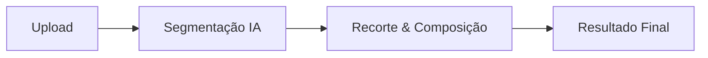

# ⚡ ColorPop: Destaque com Inteligência Artificial


O **ColorPop** é uma aplicação web de alta performance voltada para edição fotográfica seletiva. Utilizando o modelo de segmentação do **MediaPipe** executado diretamente no navegador (client-side), a aplicação isola a pessoa principal em tempo real, aplicando desfoque e escala de cinza (preto e branco) ao plano de fundo.

---

## 🧠 Como Funciona

1. **Upload da Imagem**: A imagem é processada localmente para garantir máxima privacidade e performance.
2. **Segmentação por IA**: O modelo *Selfie Segmentation* (WebAssembly) gera uma máscara de pixels identificando o sujeito.
3. **Composição Gráfica (GPU)**: O Canvas HTML5 recorta o sujeito em cores e o sobrepõe ao plano de fundo desfocado em preto e branco.



---

## 📂 Estrutura do Projeto

* 📄 [index.html](file:///data/data/com.termux/files/home/color-pop/index.html) - Estrutura HTML e metadados SEO/PWA.
* 🎨 [style.css](file:///file:///data/data/com.termux/files/home/color-pop/style.css) - Interface responsiva com efeitos *glassmorphism*.
* ⚙️ [app.js](file:///data/data/com.termux/files/home/color-pop/app.js) - Inicialização do modelo MediaPipe e processamento de imagem.
* 📱 [manifest.json](file:///data/data/com.termux/files/home/color-pop/manifest.json) / [sw.js](file:///data/data/com.termux/files/home/color-pop/sw.js) - Arquivos essenciais para suporte a PWA (execução offline).

---

## 🚀 Deploy e Domínio

### Hospedagem na Vercel
1. Envie o projeto para o GitHub:
   ```bash
   git init && git add . && git commit -m "feat: init colorpop"
   git branch -M main && git remote add origin <sua-url> && git push -u origin main
   ```
2. Importe o repositório na [Vercel](https://vercel.com) como projeto estático e faça o deploy.

### Domínio Personalizado (DNS)
Adicione as seguintes entradas na zona de DNS do seu domínio:

| Tipo | Nome | Valor / Destino |
| :--- | :--- | :--- |
| **A** | `@` | `76.76.21.21` |
| **CNAME** | `www` | `cname.vercel-dns.com.` |

---

## 💎 Vantagens do PWA
* **Execução Offline**: Armazenamento em cache pelo Service Worker (`sw.js`).
* **Instalável**: Pode ser adicionado à tela inicial como um aplicativo nativo.
* **Contexto Seguro**: O MediaPipe exige HTTPS para carregar os módulos em WebAssembly.
