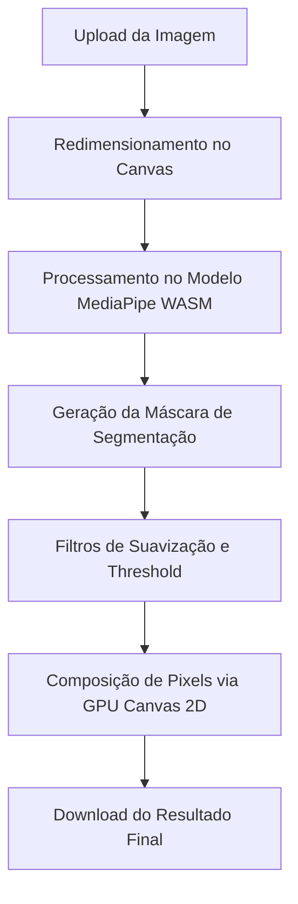

# ⚡ ColorPop: Destaque com Inteligência Artificial

O **ColorPop** é uma aplicação web de alta performance voltada para edição fotográfica seletiva. Utilizando o modelo de segmentação do **MediaPipe** executado diretamente no navegador (client-side), a aplicação isola o assunto/pessoa principal de uma foto em tempo real, aplicando desfoque (blur) e escala de cinza (preto e branco) ao plano de fundo. Isso cria um efeito profissional de profundidade de campo, destacando a pessoa de forma instantânea.

---

## ✨ Funcionalidades Principais

* **Isolamento de Sujeito em Tempo Real:** Segmentação automática e precisa do assunto principal (selfie/pessoas).
* **Controle Dinâmico de Desfoque:** Ajuste da intensidade do desfoque do plano de fundo através de um slider intuitivo.
* **Ajuste de Sensibilidade (Threshold):** Controle sobre o limite de detecção da Inteligência Artificial para refinar as bordas.
* **Processamento 100% Local:** Suas imagens nunca são enviadas para um servidor. Todo o processamento ocorre no seu dispositivo, garantindo privacidade absoluta e velocidade.
* **Suporte a Progressive Web App (PWA):** Instale a aplicação no seu smartphone ou desktop e utilize-a mesmo sem conexão com a internet.
* **Interface Responsiva:** Design moderno com efeitos de *glassmorphism* otimizado para celulares e computadores.

---

## 🧠 Detalhes Técnicos e Funcionamento do Pipeline

A segmentação de imagem do ColorPop funciona através de uma arquitetura híbrida de rede neural e aceleração gráfica por hardware:

### 1. Segmentação com MediaPipe Selfie Segmentation
* **Tecnologia:** O modelo do Google roda através de **WebAssembly (WASM)** diretamente no navegador, permitindo executar operações matemáticas complexas em velocidade próxima à nativa.
* **Máscara de Canal Alpha:** A IA gera uma máscara de pixels em escala de cinza (canal de probabilidade) onde o branco representa o sujeito detectado e o preto representa o fundo.

### 2. Processamento e Composição no Canvas HTML5
Para garantir alta taxa de quadros e não sobrecarregar o processador (CPU) do dispositivo:
* **Fundo Desfocado:** Um canvas secundário aplica os filtros CSS `blur()` e `grayscale()` diretamente sobre a imagem de fundo.
* **Recorte do Sujeito:** Usando a operação de composição gráfica `destination-in` do Canvas 2D, a foto original colorida é mascarada, isolando a pessoa com bordas suavizadas.
* **Combinação Final:** O assunto recortado em cores é sobreposto ao fundo modificado em preto e branco.

---

## 📂 Estrutura do Projeto

* 📄 [index.html](file:///data/data/com.termux/files/home/color-pop/index.html) - Estrutura semântica, metadados de SEO, pré-carregamento de recursos e viewport responsivo.
* 🎨 [style.css](file:///data/data/com.termux/files/home/color-pop/style.css) - Estilização baseada em Design Tokens (variáveis CSS), layout flexível e animações de feedback visual.
* ⚙️ [app.js](file:///data/data/com.termux/files/home/color-pop/app.js) - Orquestrador que gerencia o carregamento assíncrono dos scripts do MediaPipe, loops de renderização do Canvas e eventos dos controles da UI.
* 📱 [manifest.json](file:///data/data/com.termux/files/home/color-pop/manifest.json) - Metadados do PWA, definindo cores de tema, ícones adaptáveis (*maskable*) e modo de exibição em tela cheia.
* 📡 [sw.js](file:///data/data/com.termux/files/home/color-pop/sw.js) - Service Worker configurado para cache offline de assets essenciais.

---

## 💎 Vantagens da Arquitetura PWA

* **Execução Offline:** O Service Worker faz o cache de todas as dependências locais. Uma vez carregado, o ColorPop funciona perfeitamente sem internet.
* **Instalável:** Suporta a instalação na tela inicial no Android, iOS, Windows e macOS como um aplicativo nativo.
* **Segurança Restrita (HTTPS):** Módulos WebAssembly e recursos modernos do navegador exigem um contexto seguro. Portanto, a aplicação requer HTTPS para carregar os modelos de IA.

---

## 🛠️ Desenvolvimento e Contribuição

Desenvolvido com foco em alta performance e privacidade no processamento de imagens.

* 💻 **Desenvolvedor:** [@bersou](https://github.com/bersou)
* ⚡ **Tecnologias:** JavaScript Vanilla (ES6+), HTML5 Canvas API e CSS3 Custom Properties.
* 🧠 **IA Pipeline:** Google MediaPipe Selfie Segmentation via WASM.
* 🎨 **UI/UX:** Design moderno e fluído baseado em Glassmorphism.
* 📄 **Licença:** MIT

Se este projeto te ajudou ou inspirou, sinta-se à vontade para deixar uma estrela ⭐ no repositório!
