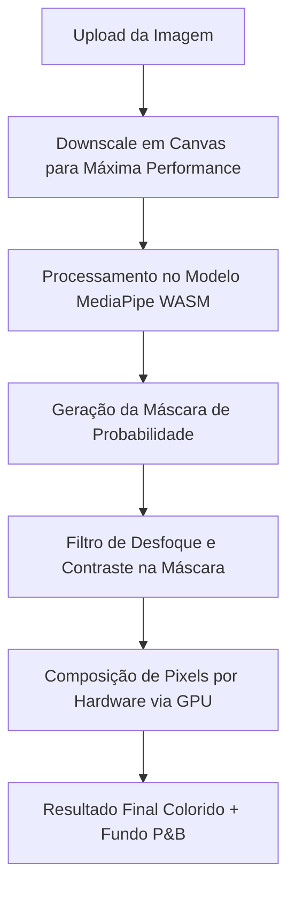

# ⚡ ColorPop: Destaque com Inteligência Artificial

[HTML5](https://img.shields.io/badge/html5-%23E34F26.svg?style=for-the-badge&logo=html5&logoColor=white)
[CSS3](https://img.shields.io/badge/css3-%231572B6.svg?style=for-the-badge&logo=css3&logoColor=white)
[JavaScript](https://img.shields.io/badge/javascript-%23F7DF1E.svg?style=for-the-badge&logo=javascript&logoColor=black)
[MediaPipe](https://img.shields.io/badge/MediaPipe-007ACC?style=for-the-badge&logo=google&logoColor=white)
[PWA](https://img.shields.io/badge/PWA-5A0E4E?style=for-the-badge&logo=pwa&logoColor=white)
[Vercel](https://img.shields.io/badge/vercel-%23000000.svg?style=for-the-badge&logo=vercel&logoColor=white)

O **ColorPop** é uma aplicação web de alta performance voltada para edição fotográfica seletiva. Utilizando modelos de redes neurais profundas executados diretamente no lado do cliente (client-side), a aplicação isola o assunto/pessoa principal de uma foto em tempo real, aplicando desfoque e escala de cinza (preto e branco) ao plano de fundo. 

Esta documentação detalha a arquitetura do projeto, as linguagens utilizadas, o funcionamento do pipeline de Inteligência Artificial e o roteiro para publicação em nuvem como um Progressive Web App (PWA) sob um domínio personalizado.

---

## 🛠️ Pilha de Tecnologias (Stack) e Métricas das Linguagens

O projeto foi construído utilizando tecnologias web nativas para garantir máxima velocidade de carregamento, independência de servidores robustos e compatibilidade multiplataforma.

### Distribuição do Código
* **HTML5 (Estruturação)**: `~15%` do projeto. Define a semântica da aplicação, links de metadados para PWA (Open Graph, Manifest) e containers dos elementos de controle e visualização.
* **CSS3 (Design e Layout)**: `~40%` do projeto. Arquitetura baseada em variáveis CSS (design tokens), efeitos modernos de *glassmorphism*, animações fluidas de iluminação e responsividade móvel.
* **JavaScript (Lógica e Computação Gráfica)**: `~45%` do projeto. Responsável pela inicialização da rede neural do MediaPipe, manipulação dos elementos de Canvas 2D e aceleração gráfica por GPU.

---

## 🧠 Funcionamento do Pipeline de Inteligência Artificial

A mágica do ColorPop baseia-se em segmentação de imagem baseada em Aprendizado de Máquina (Machine Learning).



### 1. Modelo MediaPipe Selfie Segmentation
Em vez de enviar a foto para um servidor externo (o que consumiria dados, seria lento e exporia a privacidade do usuário), a aplicação importa e executa o modelo de rede neural **Selfie Segmentation** do Google compilado em WebAssembly (WASM).
* O modelo analisa a imagem e gera uma máscara de pixels em escala de cinza onde a cor branca ($255$) representa certeza absoluta do assunto principal e preto ($0$) representa o plano de fundo.

### 2. Composição Gráfica Acelerada (GPU)
Para evitar loops pesados em JavaScript que travariam a CPU do celular, o ColorPop usa a aceleração de hardware nativa do Canvas HTML5:
* **Fundo**: Um canvas secundário renderiza a imagem original aplicando os filtros de CSS `blur()` e `grayscale()`.
* **Máscara**: A máscara gerada pela IA recebe filtros dinâmicos de `blur()` (Feather) e `contrast()` (Sensibilidade/Threshold) e é desenhada em um canvas de máscara temporário.
* **Sujeito (Recorte)**: A foto colorida original é sobreposta à máscara usando o modo de composição gráfica `destination-in`. Isso recorta o assunto preservando bordas com antisserrilhamento perfeito.
* **Mesclagem**: O assunto recortado é colado em cima do fundo desfocado e em preto e branco.

---

## 📂 Estrutura de Arquivos do Projeto

Abaixo estão os arquivos que compõem a aplicação:

* 📄 **[index.html](file:///data/data/com.termux/files/home/color-pop/index.html)**: Contém o esqueleto da aplicação, os metadados Open Graph para visualização de link e a estrutura dos inputs do painel.
* 🎨 **[style.css](file:///data/data/com.termux/files/home/color-pop/style.css)**: Gerencia os estilos visuais, a imagem de fundo suave ([soft_dark_bg.png](file:///data/data/com.termux/files/home/color-pop/soft_dark_bg.png)) e a responsividade.
* ⚙️ **[app.js](file:///data/data/com.termux/files/home/color-pop/app.js)**: Orquestra o ciclo de vida do modelo MediaPipe, o processamento de imagens e as interações dos controles.
* 📱 **[manifest.json](file:///data/data/com.termux/files/home/color-pop/manifest.json)**: Arquivo de configuração que descreve o app para o sistema operacional, permitindo a instalação PWA.
* 📡 **[sw.js](file:///data/data/com.termux/files/home/color-pop/sw.js)**: Service Worker responsável por gerenciar cache de arquivos locais, viabilizando o funcionamento offline e instalação.

---

## 🚀 Roteiro de Deploy em Nuvem e Configuração de Domínio

Como a aplicação processa tudo no lado do cliente (100% *client-side*), ela pode ser hospedada gratuitamente em CDNs globais (*Content Delivery Networks*) de altíssima velocidade.

### 🌐 Hospedagem Recomendada (Vercel ou Netlify)

#### Passo 1: Publicação do Código no GitHub
1. Inicialize o Git na pasta local do projeto e envie-o para o seu repositório:
   ```bash
   git init
   git add .
   git commit -m "feat: setup colorpop PWA with MediaPipe"
   git branch -M main
   git remote add origin <url-do-repositorio>
   git push -u origin main
   ```

#### Passo 2: Vinculação com a Vercel
1. Acesse o console da [Vercel](https://vercel.com) e conecte sua conta do GitHub.
2. Selecione **"Import Project"** no repositório criado.
3. Nas opções de compilação, certifique-se de manter o preset como **Other** (hospedagem estática pura).
4. Clique em **Deploy**. A plataforma disponibilizará um subdomínio seguro com HTTPS ativo (ex: `https://seu-app.vercel.app`).

### 🏷️ Configuração de Domínio Personalizado e DNS

Para vincular um domínio próprio (ex: `https://suaedicao.com.br`), siga estes passos de engenharia de rede:

1. No painel do seu projeto na Vercel, acesse **Settings** > **Domains**.
2. Digite o endereço do seu domínio e clique em **Add**.
3. Acesse o painel da sua empresa registradora de domínio (Registro.br, GoDaddy, Cloudflare, etc.) e configure a zona de DNS adicionando duas entradas fundamentais:

| Tipo | Nome | Valor / Destino | Finalidade |
| :--- | :--- | :--- | :--- |
| **A** | `@` (ou vazio) | `76.76.21.21` | Aponta o domínio raiz diretamente para o cluster global da Vercel |
| **CNAME** | `www` | `cname.vercel-dns.com.` | Redireciona o tráfego secundário de forma segura |

4. **SSL/HTTPS automático**: Uma vez configurado, a Vercel emitirá automaticamente um certificado SSL Let's Encrypt gratuito com renovação automatizada.

---

## 💎 Benefícios Técnicos e Arquitetura PWA

Esta seção detalha o porquê da estrutura desta aplicação corresponder aos mais modernos padrões da Web:

### 🛡️ Segurança e Contexto Seguro (HTTPS)
O modelo **MediaPipe** utiliza WebAssembly (WASM) e chamadas do navegador que exigem **Contexto Seguro**. Por isso, a hospedagem HTTPS é mandatória. Sem ela, o navegador bloqueia o carregamento dos módulos de Inteligência Artificial por motivos de segurança do usuário.

### ⚡ Vantagens do PWA (Progressive Web App)
Ao instalar a aplicação na tela inicial do dispositivo, você garante:
* **Execução Offline**: Os scripts e assets estão listados em `sw.js` e são cacheados localmente. A aplicação abre instantaneamente mesmo em modo avião.
* **Experiência Imersiva (App-like)**: Ao abrir o ícone, o navegador esconde as barras de endereço e botões de navegação padrão, abrindo a tela cheia.
* **Ícone Sem Margem (Maskable)**: O ícone configurado no `manifest.json` suporta o formato *maskable*, adaptando-se a formatos circulares, quadrados ou arredondados no Android e iOS sem exibir bordas brancas.

### 🔍 Otimização de Busca (SEO) e Compartilhamento (Open Graph)
Os metadados adicionados ao `<head>` da aplicação garantem que:
* Ferramentas de busca (Google, Bing) indexem e cataloguem o aplicativo com facilidade.
* O envio do link no WhatsApp, Telegram ou Twitter exiba um card contendo o banner profissional `og-image.png`, aumentando drasticamente a taxa de cliques e a confiança do usuário.
